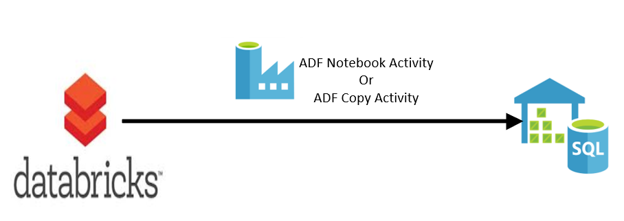
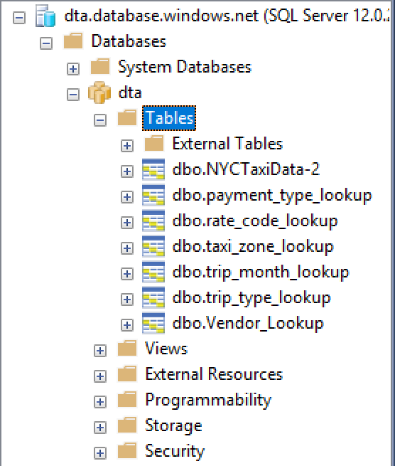
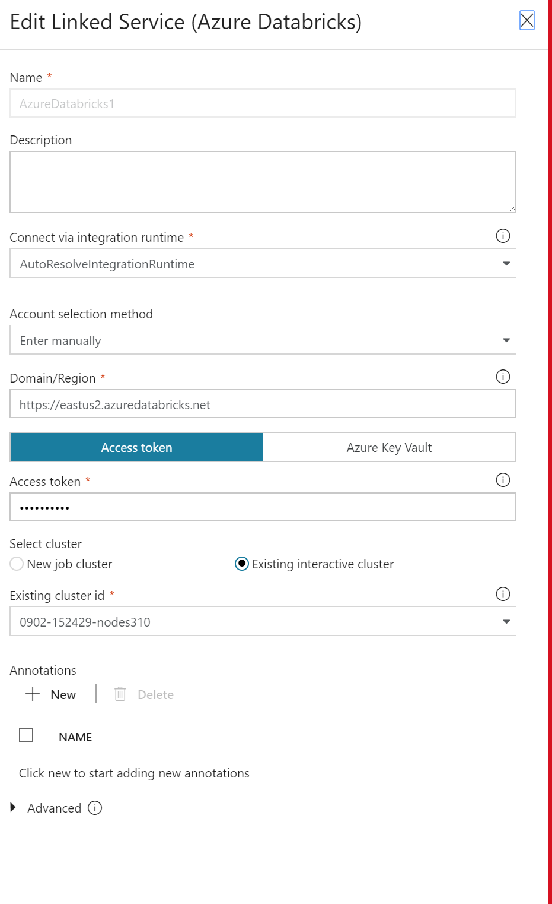
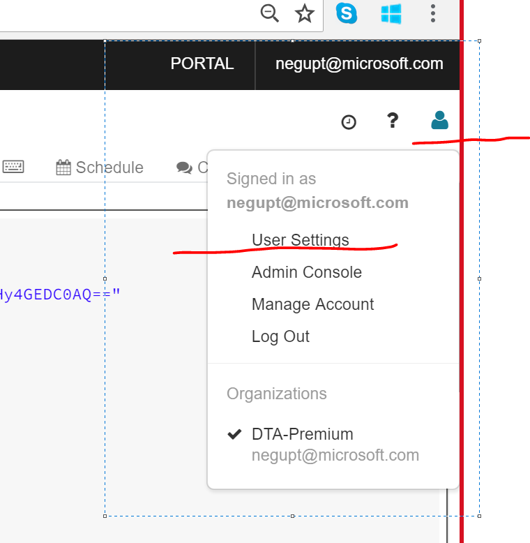
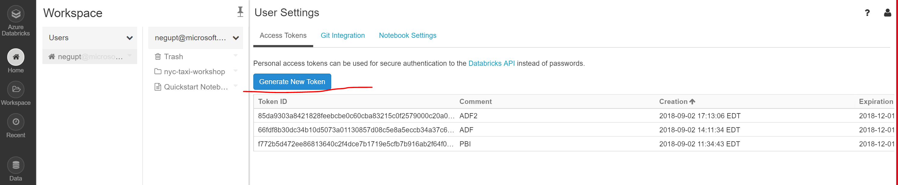
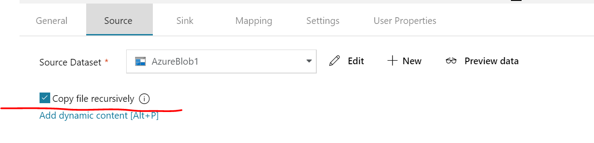
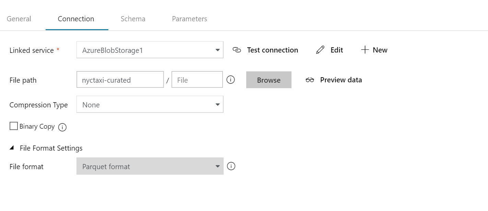
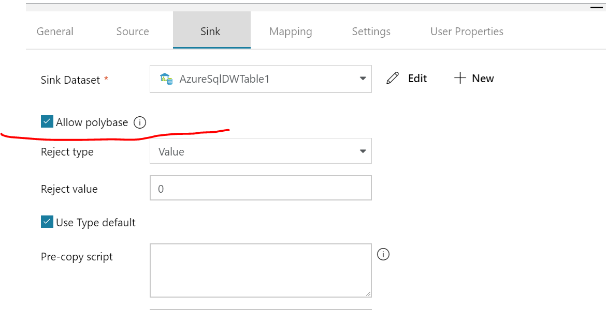
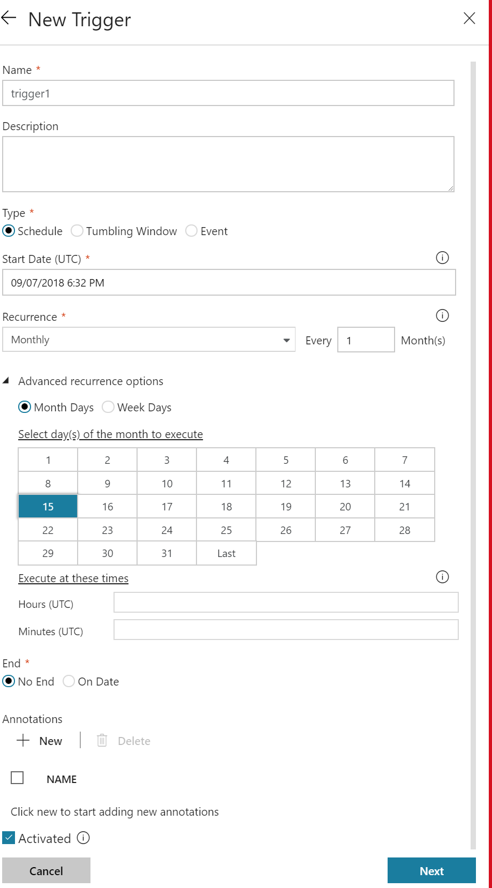

# [Proctor Guide] Challenge 03 –Copy data from Azure Databricks to SQL DW

# Summary

In this challenge you will copy reference and aggregated data tables from Databricks to SQL DW using Azure Data Factory and Polybase.  You can use ADF runbook activity or ADF copy activity to achieve this task. Once you successfully create an activity please schedule ADF job to run on 15th of every month.

## Prerequisites

* Azure SQL DW (Gen1 or Gen2) should be up and running

* Azure Data Factory V2 project

* This challenge is based on challenge 1 and 2. By now you should have a Databricks cluster running and the processed data should be in external hive tables over parquet files in blob storage.

## Reference links

Run Notebook using ADF - <https://docs.databricks.com/spark/latest/data-sources/azure/sql-data-warehouse.html>

ADF Copy Activity -  <https://docs.microsoft.com/en-us/azure/data-factory/copy-activity-overview>

This task is complete when:  you see 6 reference tables and 1 aggregated table under SQL Datawarehouse database. And when you query tables it should show data.

## Notes for Proctors

You can use either Notebook Activity or Copy Activity to copy data from Databricks to SQL DW.

### Option -1 – Using Notebook Activity

Here are the sample Notebooks for how to send data from Databricks to SQL DW. These files are in the Challenge03 folder. Please feel free to import these files under your cluster.

* Send-Ref-Tables-to-SQLDW.scala
* Send-TransactionalTable-To-SQLDW.scala

Steps to run Notebook Activity in Azure Data Factory

1. Add a Notebook Activity in ADF.
2. Add connection to Databricks cluster
3. You will need User token when you create connection as shown:

4. How to generate user token?

    1. Click on the user settings in Databricks cluster as shown

    2. Please click “Generate New Token” as shown

5. How to get Cluster id ?
In your Databricks Cluster URL, highlighted string is your cluster id. <https://eastus2.azuredatabricks.net/?o=7547854920161093#setting/account>

6. Please make sure to run this command in SQL DW before running ADF activity.
Create Master Key

### Option -2 - Using ADF copy Activity

Copy data using copy activity

1. Source – Azure blob storage
2. Sink – Azure SQL DW

Source/Blob settings – please check “Copy files recursively”

Please make sure Parquet format is selected.

Sink/SQL DW Settings: -  Please check “Allow polybase” if not already checked.

ADF Job Scheduling: -
Please create a New Trigger as shown

