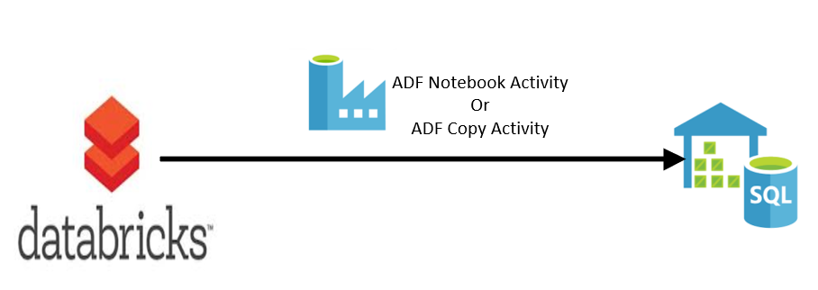
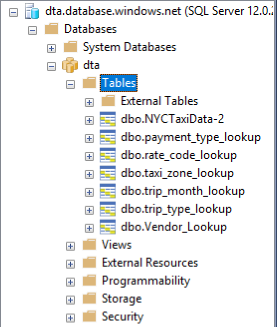

# Challenge 03 –Copy data from Azure Databricks to SQL DW

## Summary

In this challenge you will copy reference and transactional data tables from Databricks to SQL DW using Azure Data Factory and Polybase.  You can use ADF runbook activity or ADF copy activity to achieve this task. Once you successfully create an activity please schedule ADF job to run on 15th of every month.

## Prerequisites

* Azure SQL DW (Gen1 or Gen2) should be up and running
* Azure Data Factory V2 project 
* This challenge is based on challenge 1 and 2. By now you should have a Databricks cluster running and the processed data should be in external hive tables over parquet files in blob storage.

## Reference links

Run Notebook using ADF - <https://docs.databricks.com/spark/latest/data-sources/azure/sql-data-warehouse.html>

ADF Copy Activity -  <https://docs.microsoft.com/en-us/azure/data-factory/copy-activity-overview>

This task is complete when:  
You see 6 reference tables and 1 aggregated table under SQL Datawarehouse database. And when you query tables it should show data.

