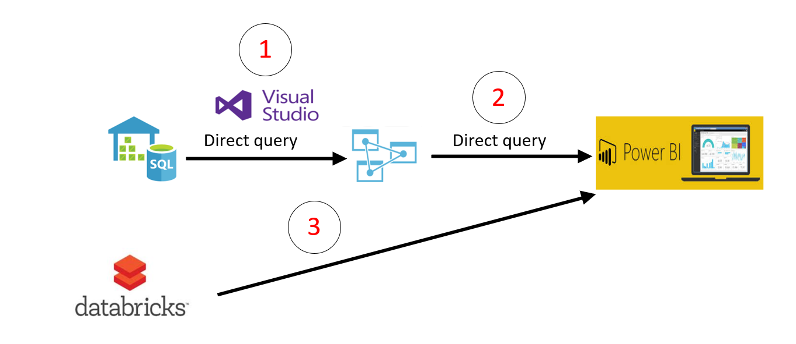
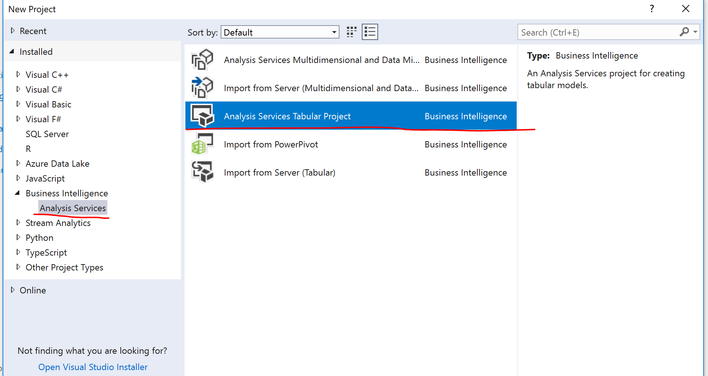
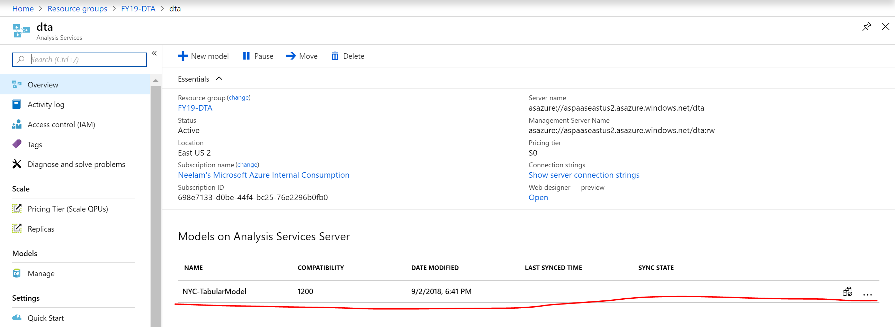

# Challenge 04 –Create a Semantic Model in Analysis Services and Power BI Visualization.

## Summary

In this challenge you will complete 3 tasks.

## Tasks

### Task-1

You will create an Analysis Services tabular project on top of Azure SQL DW using direct query mode. 

Create Start Schema and relationship b/w Dimension and Fact tables using Sql Server Data Tools. 

Create a calculated column- Trip duration in the Analysis services project. 

Deploy the final model to Azure Analysis Services Server.

### Task-2

Create following charts in Power BI desktop using Azure Analysis Services as a source and publish to Power BI online.

1. Total Trips by Taxi Type - Yellow and Green 
2. Total Passengers by Year and Taxi type
3. Count of trips over the timeframe of the trip
4. Taxi passengers sometimes leave no tip. To maximize their drivers’ income, the taxi companies would like to see “zero tip” trips by taxi company, hour of day, and pickup/dropoff location. Your challenge is how to address this question with one or more simple-to-understand visualizations! Help the taxi companies help their drivers to make more money.
5. NYC officials tell you that some of their staff are very non-technical and would prefer to speak questions of the data in plain language rather than use mouse and keyboard. For example, a senior executive would like to just ask “what was the total number of taxi trips in 2016 to 2018” and see a visualization. Can you provide this capability? They would also like to drill down at month level.

### Task-3

Connect Power BI with Databricks. Please create following reports

1. Total Trips by Rate code description.
2. Total Trips by Vendor
3. Total Trips by payment type and Zone 
4. Total Trips by peak hour

## Prerequisites for all tasks

* Azure SQL DW should be up and running and you should have reference tables and aggregated table in SQL DW.
* Azure Analysis Services should be running.
* Visual Studio/SSDT with Business Intelligence Project Type

* This challenge is based on challenge 1, 2 and 3.
* Power BI Desktop
* Power BI Online (optional)
* Azure Databricks premium cluster with hive tables

## Your tasks are complete when

### Task 1

You see the deployed model under Azure Analysis Services. Browse this model and it should show data and also the calculate column Trip duration.

### Task 2

You should have all reports in Power BI desktop and publish Power BI online (optional)

### Task 3

You are successfully able to connect Power BI desktop with Databricks Cluster and have all required reports
